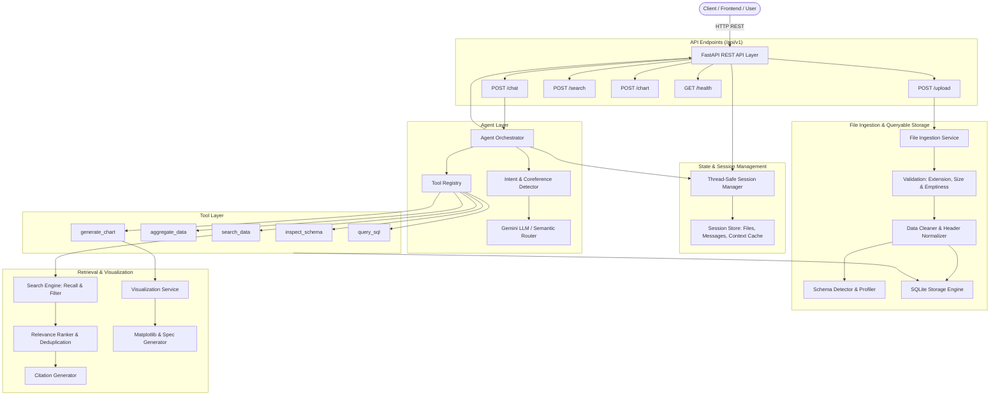

# AI-Powered Tabular Data Analysis, Search & Visualization Agent Platform

A production-ready, modular, and scalable AI system designed to ingest Excel (`.xlsx`, `.xls`) and CSV files, parse schemas, manage stateful sessions, execute search and analytics workflows, and deliver Top-K insights, verifiable source citations, and dynamic visualizations through clean REST APIs.

---

## 1. Project Overview

Modern enterprise data analysis frequently encounters large spreadsheets and CSVs that overwhelm standard in-memory pipelines or lack seamless natural-language interfaces. This platform combines:
* **Streaming & Chunked Ingestion:** Handles large tabular files without in-memory bottlenecking by indexing rows into queryable embedded SQLite tables.
* **Dual-Mode Agent Orchestration:** Employs Google Gemini (`gemini-2.5-flash` via the official `google-genai` SDK) when configured, and falls back to a deterministic semantic rule and query router for offline/air-gapped reliability.
* **Stateful Multi-Turn Conversations:** Preserves context across turns, enabling coreference resolution (e.g. *"Show me the top 5 products"* followed by *"Make a chart for that"*).
* **Two-Stage Retrieval & Source Citations:** Employs candidate retrieval, relevance ranking, deduplication, and row-level citation references (`Source: sales.csv (Row 12)`).
* **Multi-Format Visualizations:** Generates Bar, Line, Pie, Scatter, Histogram, and Time-Series charts, returning both high-DPI Base64 image strings and declarative JSON specifications for frontend rendering.

---

## 2. Architecture



---

## 3. Folder Structure

```
c:\VS_CODE\multi_agent\
├── app/
│   ├── api/
│   │   ├── endpoints/
│   │   │   ├── chat.py             # POST /chat
│   │   │   ├── chart.py            # POST /chart
│   │   │   ├── health.py           # GET /health
│   │   │   ├── search.py           # POST /search
│   │   │   └── upload.py           # POST /upload
│   │   └── router.py               # Combined API v1 router
│   ├── agents/
│   │   ├── intent_detector.py      # Intent classifier & coreference resolution
│   │   ├── llm_client.py           # Google Gemini API client
│   │   └── orchestrator.py         # Full request-agent-tool-response loop
│   ├── tools/
│   │   ├── base.py                 # Abstract BaseTool with schema validation
│   │   ├── aggregate_tool.py       # Group-by summarization & Top-K tool
│   │   ├── chart_tool.py           # Chart generation tool
│   │   ├── inspect_schema_tool.py  # Schema profiling & inspection tool
│   │   ├── query_sql_tool.py       # Read-only SQL executor
│   │   ├── registry.py             # Central tool registry
│   │   └── search_tool.py          # Data retrieval tool
│   ├── services/
│   │   ├── data_cleaner.py         # Column header & string sanitization
│   │   ├── file_service.py         # Chunked ingestion & upload management
│   │   ├── schema_detector.py      # Type inference & cardinality profiler
│   │   ├── storage_engine.py       # Embedded SQLite queryable persistence
│   │   └── visualization_service.py# Multi-chart generator (Base64 + JSON)
│   ├── retrieval/
│   │   ├── citation.py             # Verifiable source citations
│   │   ├── ranker.py               # Token scoring & deduplication ranker
│   │   └── search_engine.py        # Candidate retrieval & filter pipeline
│   ├── state/
│   │   ├── session_manager.py      # Thread-safe session tracker
│   │   └── state_models.py         # Session and conversation models
│   ├── models/
│   │   └── domain.py               # Core business & domain models
│   ├── schemas/
│   │   ├── chat.py                 # Pydantic chat request/response schemas
│   │   ├── chart.py                # Pydantic chart request/response schemas
│   │   ├── common.py               # Error & health schemas
│   │   ├── search.py               # Pydantic search schemas
│   │   └── upload.py               # Pydantic upload schemas
│   ├── utils/
│   │   ├── config.py               # App configuration & environment settings
│   │   ├── exceptions.py           # Typed application exception hierarchy
│   │   └── logger.py               # Structured logger
│   └── main.py                     # FastAPI application entrypoint
├── configs/
│   └── default.yaml                # Default application configuration
├── data/
│   ├── dbs/                        # SQLite queryable databases
│   ├── uploads/                    # Raw uploaded files
│   └── sample_sales.csv            # Included demonstration dataset
├── tests/
│   ├── conftest.py                 # Fixtures, test client, and test data
│   ├── test_agents.py              # Agent intent & coreference tests
│   ├── test_api_endpoints.py       # Full API integration tests
│   ├── test_error_handling.py      # Edge case & validation error tests
│   ├── test_file_service.py        # File validation & chunked ingestion tests
│   ├── test_retrieval.py           # Ranking, deduplication & citation tests
│   ├── test_state_manager.py       # Session lifecycle & context cache tests
│   ├── test_tools.py               # Tool execution & safety tests
│   └── test_visualization.py       # Chart generation & rendering tests
├── .env.example
├── .gitignore
├── Dockerfile
├── docker-compose.yml
├── requirements.txt
└── README.md
```

---

## 4. Installation & Setup

### Prerequisites
* Python 3.10+ (Tested on Python 3.11)
* Git

### Step-by-Step Installation

```bash
# 1. Clone or navigate to the workspace
cd c:\VS_CODE\multi_agent

# 2. Create and activate a virtual environment
python -m venv venv
# On Windows:
venv\Scripts\activate
# On Linux/macOS:
source venv/bin/activate

# 3. Install dependencies
pip install -r requirements.txt

# 4. Configure environment variables
cp .env.example .env
```

---

## 5. Environment Variables

Configure your `.env` file according to your environment:

| Variable | Type | Default | Description |
|---|---|---|---|
| `HOST` | string | `0.0.0.0` | Server bind host address |
| `PORT` | integer | `8000` | Server listen port |
| `DEBUG` | boolean | `False` | Enable reload / debug logging |
| `UPLOAD_DIR` | string | `./data/uploads` | Path for raw uploaded files |
| `DB_DIR` | string | `./data/dbs` | Path for SQLite queryable tables |
| `MAX_UPLOAD_SIZE_MB` | integer | `100` | Maximum file size in megabytes |
| `CHUNK_SIZE_ROWS` | integer | `10000` | Batch size for streaming CSV chunks |
| `GEMINI_API_KEY` | string | `""` | *(Optional)* Google Gemini API Key |
| `GEMINI_MODEL` | string | `gemini-2.5-flash`| Gemini model for advanced reasoning |
| `DEFAULT_TOP_K` | integer | `5` | Default number of ranked records |

> **Note on LLM API Key:** The system does **not** hardcode any secrets and is designed to run 100% locally out-of-the-box even without an API key using its deterministic semantic intent router and SQL analytics engine. Providing `GEMINI_API_KEY` activates enhanced conversational polishing and natural language dialogue.

---

## 6. Running Locally

Start the application with Uvicorn:

```bash
python -m uvicorn app.main:app --host 0.0.0.0 --port 8000 --reload
```

* **Swagger / OpenAPI Documentation:** `http://localhost:8000/docs`
* **ReDoc Documentation:** `http://localhost:8000/redoc`
* **Health Check:** `http://localhost:8000/api/v1/health`

---

## 7. API Documentation

### A. Health Check: `GET /api/v1/health`
Checks service readiness and session telemetry.
* **Status:** `200 OK`
* **Sample Response:**
```json
{
  "status": "ok",
  "version": "1.0.0",
  "active_sessions": 2,
  "storage_ready": true
}
```

---

### B. File Upload: `POST /api/v1/upload`
Uploads CSV or Excel files (`.xlsx`, `.xls`), performs validation, creates SQLite indexed tables, profiles columns, and registers metadata.
* **Content-Type:** `multipart/form-data`
* **Parameters:**
  * `file`: Binary file (required)
  * `session_id`: String (optional; created if omitted)
* **Status:** `201 Created`
* **Sample Response:**
```json
{
  "success": true,
  "session_id": "sess-a1b2c3",
  "file_id": "f8a910",
  "file_name": "sales.csv",
  "file_size_bytes": 102400,
  "row_count": 1500,
  "column_count": 5,
  "columns": [
    {
      "name": "product",
      "data_type": "string",
      "null_count": 0,
      "unique_count": 15,
      "is_numeric": false,
      "is_temporal": false,
      "is_categorical": true,
      "sample_values": ["MacBook Pro 16", "Dell XPS 15"]
    },
    {
      "name": "revenue",
      "data_type": "float",
      "null_count": 0,
      "unique_count": 250,
      "is_numeric": true,
      "is_temporal": false,
      "is_categorical": false,
      "sample_values": [2499.0, 1899.5]
    }
  ],
  "message": "File successfully parsed and indexed."
}
```

---

### C. Chat & Conversational Analysis: `POST /api/v1/chat`
Answers natural language queries, performs aggregations, searches records, and generates visualizations while tracking conversation state.
* **Content-Type:** `application/json`
* **Request Body:**
```json
{
  "query": "Show me the top 5 products by revenue",
  "session_id": "sess-a1b2c3"
}
```
* **Status:** `200 OK`
* **Sample Response:**
```json
{
  "session_id": "sess-a1b2c3",
  "query": "Show me the top 5 products by revenue",
  "intent": "data_analysis",
  "answer": "Here are the Top 5 product by SUM(revenue):\n\n1. **MacBook Pro 16**: 2,499.00 (1 records)\n2. **MacBook Pro 14**: 1,999.00 (1 records)\n3. **Dell XPS 15**: 1,899.50 (1 records)\n4. **MacBook Air 15**: 1,299.00 (1 records)\n5. **LG UltraFine 32**: 1,299.00 (1 records)",
  "tool_calls": [
    {
      "tool_name": "aggregate_data",
      "parameters": {
        "group_by_column": "product",
        "metric_column": "revenue",
        "aggregation": "SUM",
        "top_k": 5,
        "ascending": false
      },
      "execution_time_ms": 1.25,
      "success": true,
      "error_message": null
    }
  ],
  "citations": [
    {
      "file_id": "f8a910",
      "file_name": "sales.csv",
      "row_index": null,
      "column_names": ["product", "revenue"],
      "snippet": "summary: Top-5 product by SUM(revenue)",
      "source_description": "Source: sales.csv (Aggregated Summary over product, revenue)"
    }
  ],
  "chart": null,
  "duration_ms": 4.12
}
```

#### Coreference Follow-Up Turn:
```json
{
  "query": "Make a chart for that",
  "session_id": "sess-a1b2c3"
}
```
*Response generates the bar chart for the preceding Top-5 product aggregation automatically without re-prompting!*

---

### D. Direct Search: `POST /api/v1/search`
Retrieves Top-K ranked records matching query criteria with citations.
* **Content-Type:** `application/json`
* **Request Body:**
```json
{
  "query": "Laptop",
  "session_id": "sess-a1b2c3",
  "top_k": 5
}
```
* **Status:** `200 OK`
* **Sample Response:**
```json
{
  "session_id": "sess-a1b2c3",
  "query": "Laptop",
  "count": 3,
  "top_k": 5,
  "results": [
    {
      "row_index": 1,
      "score": 4.0,
      "data": {
        "transaction_id": "TX-1001",
        "product": "MacBook Pro 16",
        "category": "Laptops",
        "revenue": 2499.0,
        "quantity": 1
      },
      "citation": {
        "file_id": "f8a910",
        "file_name": "sales.csv",
        "row_index": 1,
        "column_names": ["category"],
        "snippet": "transaction_id: TX-1001 | product: MacBook Pro 16 | category: Laptops",
        "source_description": "Source: sales.csv (Row 1)"
      }
    }
  ]
}
```

---

### E. Direct Visualization: `POST /api/v1/chart`
Generates charts on demand.
* **Content-Type:** `application/json`
* **Request Body:**
```json
{
  "session_id": "sess-a1b2c3",
  "chart_type": "bar",
  "x_column": "category",
  "y_column": "revenue",
  "aggregation": "SUM",
  "title": "Revenue by Category",
  "top_k": 5
}
```
* **Status:** `200 OK`
* **Sample Response:**
```json
{
  "chart_type": "bar",
  "title": "Revenue by Category",
  "x_column": "category",
  "y_column": "revenue",
  "aggregation": "SUM",
  "image_base64": "data:image/png;base64,iVBORw0KGgoAAAANSUhEUg...",
  "spec_json": {
    "title": "Revenue by Category",
    "type": "bar",
    "encoding": {
      "x": {"field": "category", "type": "nominal"},
      "y": {"field": "revenue", "type": "quantitative"}
    },
    "data": [
      {"category": "Laptops", "revenue": 7696.5},
      {"category": "Smartphones", "revenue": 2997.0}
    ]
  },
  "data_points": [
    {"category": "Laptops", "revenue": 7696.5},
    {"category": "Smartphones", "revenue": 2997.0}
  ],
  "metadata": {
    "dataset_id": "f8a910",
    "points_rendered": 2
  }
}
```

---

## 8. Large File Handling Strategy

To prevent memory overflow and latency spikes when processing multi-megabyte and multi-gigabyte datasets:
1. **Streamed Disk Ingestion:** Uploaded files stream to disk in 1MB chunks without accumulating in Python memory.
2. **Chunked Reader Pipeline:** CSVs are parsed in batches (`CHUNK_SIZE_ROWS = 10,000`) using `pandas.read_csv(chunksize=...)`.
3. **Queryable Embedded SQLite Tables:** Chunks are written directly into an embedded SQLite table (`data_{file_id}`).
4. **Indexed Columns:** Automatic B-tree indexes are built on the first 5 columns and text categorical attributes.
5. **Database-Level Aggregation:** Calculations (e.g. `SUM`, `AVG`, `COUNT`, `GROUP BY`, `ORDER BY`) execute in SQL, reading only indexed pages rather than instantiating dataframes for millions of rows.
6. **Limit & Offset Pagination:** Record queries and sample views employ strict pagination to constrain payload sizes.

---

## 9. Tool Suite Specifications

All tools inherit from `BaseTool` and enforce strict Pydantic/JSON schemas:

| Tool Name | Purpose | Parameters | Output Schema |
|---|---|---|---|
| `search_data` | Retrieval of matching records | `query` (str, req), `filters` (dict, opt), `top_k` (int, opt) | `results` (array), `count` (int), citations |
| `aggregate_data` | Group-by metric calculations & Top-K | `group_by_column` (str, req), `metric_column` (str, req), `aggregation` (str, opt), `top_k` (int, opt), `ascending` (bool, opt) | `results` (array), `citations` (array) |
| `generate_chart` | Data visualization generation | `chart_type` (str, req), `x_column` (str, req), `y_column` (str, opt), `aggregation` (str, opt), `title` (str, opt), `top_k` (int, opt) | `image_base64` (str), `spec_json` (dict), `data_points` (array) |
| `inspect_schema` | Dataset structure & preview | `file_id` (str, opt), `sample_limit` (int, opt) | `columns` (array), `row_count` (int), `sample_rows` (array) |
| `query_sql` | Read-only SQL query execution | `sql_query` (str, req), `file_id` (str, opt) | `results` (array), `row_count` (int), citations |

---

## 10. Visualization Specifications

Supported chart formats:
* **Bar Chart:** Categorical comparisons with custom color schemes and numeric y-axes.
* **Line Chart:** Trends and sequential continuous metrics.
* **Pie Chart:** Percentage share across top categories.
* **Scatter Plot:** Correlation between two continuous numerical variables.
* **Histogram:** Distribution frequency of numerical columns across 15 bins.
* **Time-Series Chart:** Date-sorted temporal aggregations.

Dual Render Output:
* `image_base64`: Direct PNG data URI ready for ``.
* `spec_json`: Standard declarative JSON format ready for rendering with Chart.js, Recharts, or Vega-Lite.

---

## 11. Testing

The platform includes a comprehensive automated test suite with **37 test cases** covering file processing, validations, state management, search, tools, agent routing, coreference resolution, visualizations, and API error codes.

Run tests using pytest:

```bash
pytest -v
```

Output:
```
tests/test_agents.py::test_agent_schema_intent PASSED
tests/test_agents.py::test_agent_top_5_analysis PASSED
tests/test_agents.py::test_agent_coreference_chart_for_that PASSED
tests/test_agents.py::test_agent_search_query PASSED
tests/test_api_endpoints.py::test_api_health PASSED
tests/test_api_endpoints.py::test_api_upload_csv PASSED
tests/test_api_endpoints.py::test_api_upload_excel PASSED
tests/test_api_endpoints.py::test_api_search PASSED
tests/test_api_endpoints.py::test_api_chart PASSED
tests/test_api_endpoints.py::test_api_chat_flow PASSED
tests/test_error_handling.py::test_upload_invalid_extension PASSED
tests/test_error_handling.py::test_upload_empty_file PASSED
tests/test_error_handling.py::test_search_non_existent_session PASSED
tests/test_error_handling.py::test_chart_invalid_column PASSED
tests/test_error_handling.py::test_chat_empty_query_validation PASSED
tests/test_file_service.py::test_data_cleaner PASSED
tests/test_file_service.py::test_file_validation_unsupported_extension PASSED
tests/test_file_service.py::test_file_validation_empty_file PASSED
tests/test_file_service.py::test_file_validation_too_large PASSED
tests/test_file_service.py::test_csv_processing PASSED
tests/test_file_service.py::test_excel_processing PASSED
tests/test_retrieval.py::test_relevance_ranker_scoring PASSED
tests/test_retrieval.py::test_relevance_ranker_deduplication PASSED
tests/test_retrieval.py::test_search_engine_top_k PASSED
tests/test_state_manager.py::test_session_lifecycle PASSED
tests/test_state_manager.py::test_session_file_tracking PASSED
tests/test_state_manager.py::test_session_context_update PASSED
tests/test_tools.py::test_tool_registry PASSED
tests/test_tools.py::test_search_data_tool PASSED
tests/test_tools.py::test_aggregate_data_tool PASSED
tests/test_tools.py::test_inspect_schema_tool PASSED
tests/test_tools.py::test_sql_tool_safety PASSED
tests/test_visualization.py::test_bar_chart_generation PASSED
tests/test_visualization.py::test_pie_chart_generation PASSED
tests/test_visualization.py::test_scatter_chart_generation PASSED
tests/test_visualization.py::test_histogram_generation PASSED
tests/test_visualization.py::test_invalid_column_chart PASSED

====================== 37 passed in 5.67s =======================
```

---

## 12. Docker Usage

### Build and Run with Docker:

```bash
# Build Docker image
docker build -t data-agent-platform .

# Run container
docker run -p 8000:8000 -v $(pwd)/data:/app/data data-agent-platform
```

### Run with Docker Compose:

```bash
docker-compose up --build
```

Access `http://localhost:8000/docs` to test endpoints.

---

## 13. Known Limitations & Future Improvements

### Known Limitations:
1. **Multi-Sheet Excel Files:** The current ingestion defaults to the first active sheet in an Excel workbook.
2. **In-Memory Session Store:** Active sessions reside in memory; for high-availability distributed deployments across multiple containers, a Redis or PostgreSQL session backend is recommended.
3. **Complex Nested Expressions in SQL Tool:** Only single read-only `SELECT`/`WITH` queries are permitted for safety.

### Future Improvements:
1. **Vector Embeddings & Hybrid Search:** Integrate dense vector embeddings (e.g. ChromaDB or pgvector) alongside the current lexical BM25 ranker for hybrid semantic search.
2. **Multi-File Joins:** Enable automated join detection between multiple uploaded datasets within a single session.
3. **Persistent Session Redis Adapter:** Provide a drop-in Redis adapter for distributed session scaling.
