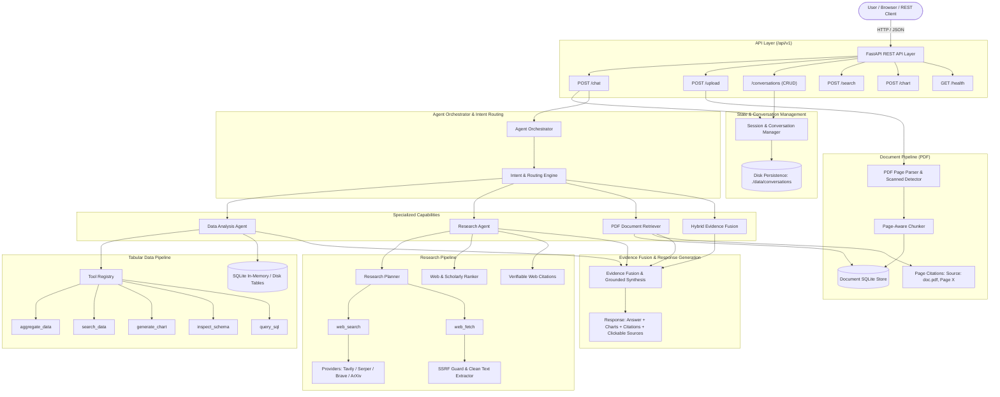

# InfinityGPT — AI Data Analysis & Research Workspace

**InfinityGPT** is a production-oriented AI workspace inspired by ChatGPT, purpose-built for conversational tabular data analysis (Excel/CSV), academic research (arXiv/web), and document intelligence (PDF).

InfinityGPT seamlessly bridges data engineering and scientific literature research: users can analyze internal business datasets, search and cite uploaded PDFs by exact page, query live public web and academic papers with verifiable citations, and run hybrid workflows that explain empirical data patterns using academic literature.

---

## 1. Core Architecture



---

## 2. Key Capabilities

### 1. ChatGPT-Style Workspace UI
* **Sidebar Conversation History:** Automatically groups previous conversations into **Today**, **Yesterday**, and **Older**.
* **Conversation Management:** Create new chats, restore full conversational context on click, inline-rename conversations, and delete chats with persistent disk storage.
* **Modern Bottom Composer:** Features auto-growing textarea, Enter to send, Shift+Enter for newline, file attachment button (`[ + ]`), attached file chips, and drag-and-drop file upload.
* **Rich Markdown & Visualizations:** Native rendering of Markdown headings, bold/italic, bullet/numbered lists, tables, syntax-formatted code blocks with copy button, and expandable tool execution indicators.
* **Clickable Sources & Citations:** Explicit sources section listing authoritative paper/documentation links with clickable URLs, alongside verifiable row-level tabular citations (`Source: sales.csv (Row 42)`) and document page citations (`Source: paper.pdf, Page 8`).

### 2. Autonomous Research Agent & Planning
* **Query Understanding & Multi-Query Planning:** Formulates targeted multi-angle search queries covering definitions, architectures, and empirical benchmarks rather than executing single uncontrolled queries.
* **Scholarly Authority Prioritization:** Automatically boosts arXiv, Semantic Scholar, ACM, IEEE, official documentation, and academic journals.
* **Readable Page & Paper Fetching:** Fetches full article content for candidate evidence extraction with SSRF defenses and content length caps.
* **Strict Grounding (No Hallucinations):** Never hallucinates papers, authors, publication dates, or URLs. If evidence is insufficient, the system transparently reports limitations.

### 3. Tabular Data Intelligence
* **Ingestion:** Supports CSV and Excel (`.xlsx`, `.xls`).
* **Streaming & Chunking:** Ingests large CSV and Excel files in row chunks directly into SQLite, preventing memory exhaustion.
* **Analytics Tools:** Includes `aggregate_data`, `search_data`, `generate_chart`, `inspect_schema`, and `query_sql` (read-only SQLite queries).
* **Charts:** Bar, Line, Pie, Scatter, Histogram, and Time-Series charts with Base64 image generation and declarative JSON specs.

### 4. PDF Document Intelligence
* **Document Pipeline:** Extracts text page-by-page using `pypdf`, chunks text while preserving exact page numbers, and indexes chunks into a conversation-scoped SQLite store.
* **Scanned PDF Detection:** Flags scanned or image-based PDFs without extractable text and reports: *"This PDF appears to be scanned and requires OCR."*
* **Page-Level Retrieval & Citations:** Responds to both specific page lookups (*"Summarize page 10 of this paper"*) and semantic topic queries with citations like `Source: paper.pdf, Page 10`.

### 5. Mixed Data + Research Workflows
* InfinityGPT natively supports hybrid workflows:
  * *"Analyze my sales.xlsx and find research papers explaining the seasonal pattern."*
  * *"Look at my dataset and tell me whether this trend is consistent with research on consumer demand."*
* The orchestrator runs data analysis on the active dataset, queries academic literature for theoretical grounding, fuses the evidence, and presents both dataset and scholarly citations.

---

## 3. Directory Layout

```
multi_agent/
├── app/
│   ├── agents/
│   │   ├── intent_detector.py      # Multi-intent routing & coreference resolution
│   │   ├── llm_client.py           # Gemini LLM client via google-genai SDK
│   │   ├── orchestrator.py         # Central agent orchestrator & hybrid fusion
│   │   ├── research_agent.py       # End-to-end autonomous research workflow
│   │   └── research_planner.py     # Multi-query planning & target budgeting
│   ├── api/
│   │   ├── endpoints/
│   │   │   ├── chat.py             # POST /api/v1/chat
│   │   │   ├── chart.py            # POST /api/v1/chart
│   │   │   ├── conversations.py    # CRUD /api/v1/conversations
│   │   │   ├── health.py           # GET /api/v1/health
│   │   │   ├── search.py           # POST /api/v1/search
│   │   │   └── upload.py           # POST /api/v1/upload (CSV, Excel, PDF)
│   │   └── router.py               # Combined API router
│   ├── documents/
│   │   ├── chunker.py              # Page-aware text chunker
│   │   ├── document_store.py       # SQLite document chunk storage
│   │   └── pdf_parser.py           # Text extraction & scanned detection
│   ├── models/
│   │   └── domain.py               # Dataset, document, citation, and source domain models
│   ├── retrieval/
│   │   ├── citation.py             # Dataset row-level citations
│   │   ├── document_retriever.py   # PDF passage retrieval & page citations
│   │   ├── ranker.py               # Tabular search ranking
│   │   ├── web_citation.py         # Clickable web citations & sources formatting
│   │   └── web_ranker.py           # Academic domain authority ranker
│   ├── schemas/                    # Pydantic request/response schemas
│   ├── services/
│   │   ├── data_cleaner.py         # Header cleaning & column sanitization
│   │   ├── file_service.py         # Upload saving, streaming Excel, and chunked CSV
│   │   ├── schema_detector.py      # Column profiling & type detection
│   │   ├── storage_engine.py       # Queryable SQLite table engine
│   │   ├── visualization_service.py# Multi-chart Matplotlib rendering
│   │   ├── web_fetch_service.py    # SSRF-guarded HTTP fetch & HTML cleaner
│   │   └── web_search_service.py   # Tavily / Serper / Brave / ArXiv search providers
│   ├── state/
│   │   ├── session_manager.py      # Thread-safe conversation manager with disk persistence
│   │   └── state_models.py         # ConversationState & SessionState definitions
│   ├── tools/
│   │   ├── base.py                 # BaseTool interface with input validation
│   │   ├── aggregate_tool.py       # aggregate_data tool
│   │   ├── chart_tool.py           # generate_chart tool
│   │   ├── document_tool.py        # search_documents tool
│   │   ├── registry.py             # ToolRegistry with core and extended tools
│   │   ├── schema_tool.py          # inspect_schema tool
│   │   ├── search_tool.py          # search_data tool
│   │   ├── sql_tool.py             # query_sql tool (read-only SQLite)
│   │   ├── web_fetch_tool.py       # web_fetch tool
│   │   └── web_search_tool.py      # web_search tool
│   ├── utils/                      # Settings, logging, and exceptions
│   └── main.py                     # FastAPI application entrypoint & static mount
├── frontend/
│   ├── app.js                      # Reactive ChatGPT-style frontend logic
│   ├── index.css                   # Rich modern dark theme stylesheet
│   └── index.html                  # Responsive sidebar & chat workspace HTML
├── data/
│   ├── conversations/              # Persistent JSON snapshots of conversations
│   ├── dbs/                        # SQLite storage databases
│   ├── sample_sales.csv            # Prepackaged sample dataset
│   └── uploads/                    # Upload directory
├── tests/                          # Complete test suite (60 test cases)
├── .env.example                    # Environment configuration template
└── requirements.txt                # Python dependencies
```

---

## 4. Security Architecture

1. **Untrusted Web & Document Input:**
   * External text fetched from webpages, papers, and PDFs is treated strictly as untrusted data.
   * LLM synthesis prompts enclose external content within `<untrusted_evidence>` tags, with system instructions forbidding external text from overriding instructions or safety policies.
2. **SSRF Defenses:**
   * `WebFetchService` validates URL schemes (`http`, `https` only).
   * Blocks connections to loopback (`127.0.0.0/8`, `localhost`, `::1`), private subnets (`10.0.0.0/8`, `172.16.0.0/12`, `192.168.0.0/16`), and link-local cloud metadata services (`169.254.169.254`).
3. **Read-Only SQL Execution:**
   * The `query_sql` tool enforces read-only access. Any statement containing `DROP`, `DELETE`, `INSERT`, `UPDATE`, `ALTER`, or `CREATE` is rejected immediately.
4. **XSS Sanitization:**
   * All user text and retrieved data in the frontend are HTML-escaped before markdown rendering.
   * Markdown links are sanitized to accept only valid `http://` and `https://` protocols.

---

## 5. Environment Configuration

Create a `.env` file in the project root based on `.env.example`:

```bash
# Server Configuration
HOST=0.0.0.0
PORT=8000
DEBUG=False

# Storage Configuration
UPLOAD_DIR=./data/uploads
DB_DIR=./data/dbs
CONVERSATIONS_DIR=./data/conversations
MAX_UPLOAD_SIZE_MB=100
CHUNK_SIZE_ROWS=10000

# AI / LLM Configuration (Optional: Gemini via google-genai)
GEMINI_API_KEY=your_gemini_api_key_here
GEMINI_MODEL=gemini-2.5-flash

# Research Agent & Web Search Configuration
# Options: tavily | serper | brave | scholarly
WEB_SEARCH_PROVIDER=tavily
TAVILY_API_KEY=your_tavily_api_key_here
SERPER_API_KEY=
BRAVE_API_KEY=
MAX_WEB_RESULTS=5
MAX_RESEARCH_SOURCES=5
MAX_FETCH_CHARS=50000
FETCH_TIMEOUT_SECONDS=15

# Document & PDF Processing
PDF_CHUNK_SIZE_CHARS=1200
PDF_CHUNK_OVERLAP_CHARS=200

# Retrieval Defaults
DEFAULT_TOP_K=5
MAX_SEARCH_RESULTS=50
```

> **Note:** If no search API key is provided, the platform automatically utilizes its built-in `ScholarlySearchProvider` (live arXiv API + academic index), ensuring valid scholarly papers with real URLs for offline or demo use.

---

## 6. Installation & Running Locally

### Prerequisites
* Python 3.10+
* pip

### Installation
```bash
# Clone the repository
git clone https://github.com/Suryakant-gig/multi_agent-demo.git
cd multi_agent-demo

# Create and activate virtual environment
python -m venv venv
# On Windows:
.\venv\Scripts\activate
# On Linux/macOS:
source venv/bin/activate

# Install dependencies
pip install -r requirements.txt
```

### Running the Application
```bash
uvicorn app.main:app --host 0.0.0.0 --port 8000 --reload
```

Open your browser:
* **InfinityGPT Workspace:** `http://localhost:8000/workspace/`
* **API Documentation (Swagger UI):** `http://localhost:8000/docs`

---

## 7. API Endpoints

| Method | Endpoint | Description |
|---|---|---|
| `POST` | `/api/v1/chat` | Main conversational endpoint (supports data, research, documents, and hybrid workflows) |
| `POST` | `/api/v1/upload` | Ingests CSV, Excel (`.xlsx`, `.xls`), or PDF files |
| `POST` | `/api/v1/upload-sample` | Loads prepackaged `sample_sales.csv` for immediate testing |
| `GET` | `/api/v1/conversations` | Lists all saved conversations with summary metadata |
| `POST` | `/api/v1/conversations` | Creates a new isolated conversation |
| `GET` | `/api/v1/conversations/{id}` | Retrieves full conversation details, messages, and active files |
| `PATCH` | `/api/v1/conversations/{id}` | Renames a conversation title |
| `DELETE` | `/api/v1/conversations/{id}` | Deletes a conversation and its persisted data |
| `POST` | `/api/v1/search` | Direct ranked row retrieval with source citations |
| `POST` | `/api/v1/chart` | Direct chart generation endpoint |
| `GET` | `/api/v1/health` | Health check and version status |

---

## 8. Example Queries

* **Data Analysis:**
  * *"Show me the top 5 products by revenue."*
  * *"What is the total sales amount in the Electronics category?"*
* **Coreference Visualizations:**
  * *"Make a chart for that."*
  * *"Generate a pie chart of revenue by category."*
* **Academic Literature & Research:**
  * *"Find 5 research papers about hybrid RAG retrieval."*
  * *"Compare the latest papers on dense versus sparse retrieval."*
  * *"What are the recent developments in agentic RAG?"*
  * *"Research the latest methods for entity resolution."*
* **PDF Document Intelligence:**
  * *"Summarize page 10 of this uploaded paper."*
  * *"What is the benchmark methodology described in Section 3?"*
* **Hybrid Data + Research:**
  * *"Analyze sales.xlsx and find research papers explaining the seasonal trend."*
  * *"Look at my dataset and tell me whether this pattern is consistent with research on consumer demand."*

---

## 9. Running Tests

The test suite contains 60 comprehensive unit and integration tests:

```bash
pytest -v
```

All 60 tests validate conversation isolation, persistence, research intent routing, web search top-k enforcement, web fetch SSRF protections, PDF text extraction, scanned PDF detection, mixed data+web orchestration, and read-only SQL safety.
